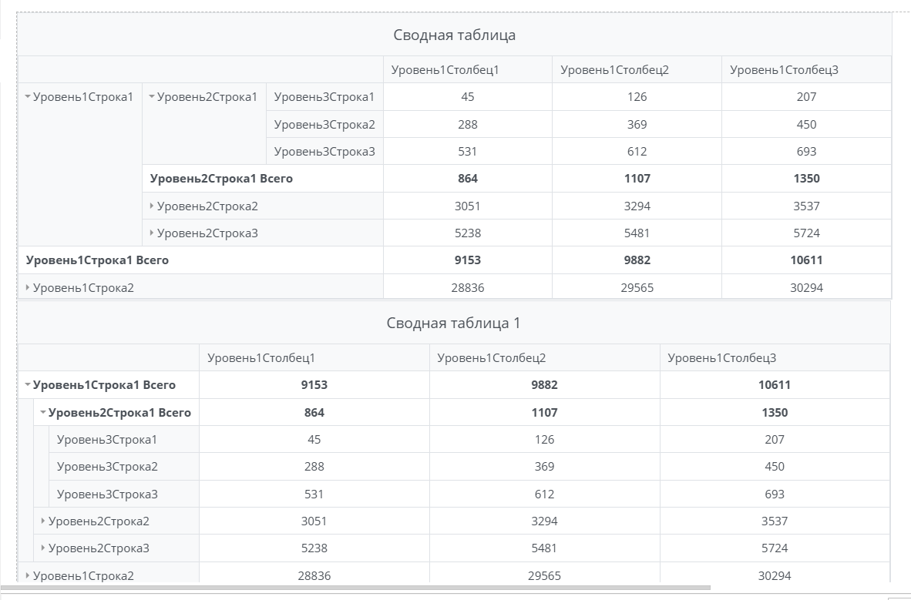
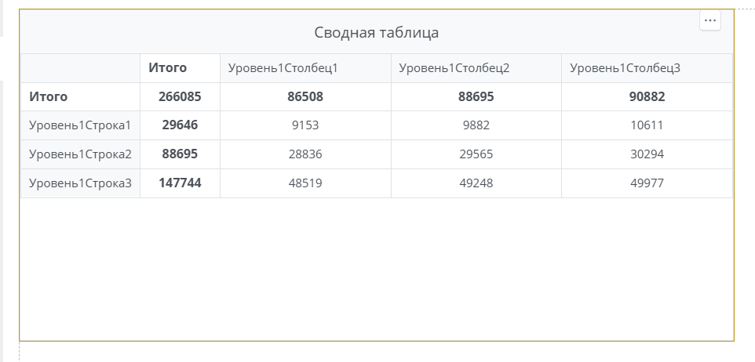
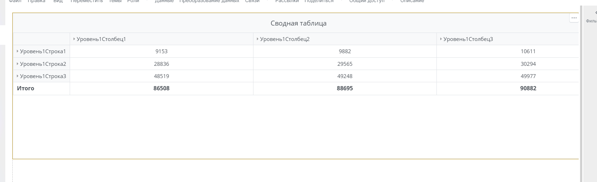
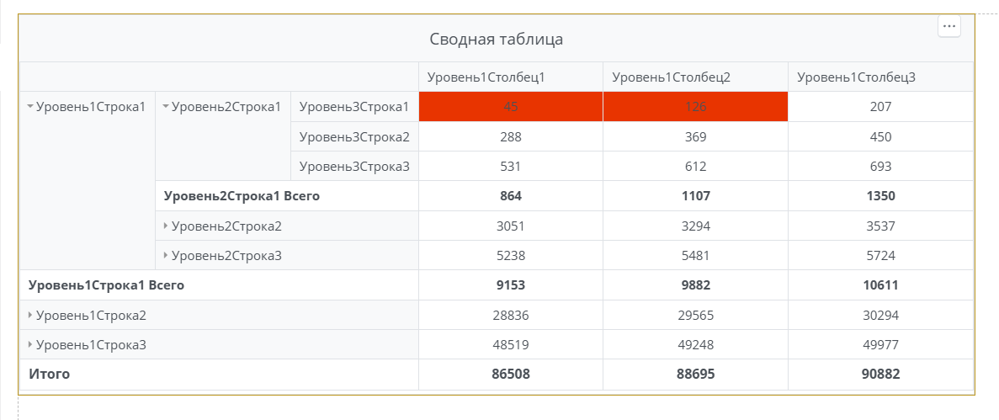
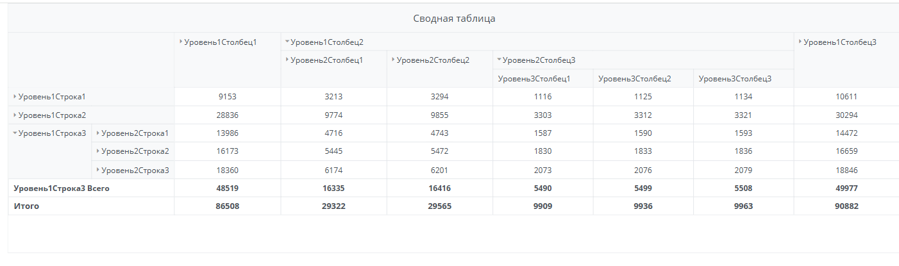

# Примеры кастомизации сводной таблицы в Visiology версии 3

## Общая информация

Сводная таблица в платформе Visiology текущей версии реализована на основе компонента PivotGrid библиотеки DevExtreme.

Кастомизацию таблицы следует выполнять свойствами и методами данной библиотеки.  
С документацией DevExtreme можно ознакомиться на официальном сайте:
- [Описание уровня отображения](https://js.devexpress.com/jQuery/Documentation/ApiReference/UI_Components/dxPivotGrid/api/)
- [Описание уровня данных](https://js.devexpress.com/jQuery/Documentation/ApiReference/Data_Layer/PivotGridDataSource/)

Следует учитывать, что библиотека была адаптирована под нужды платформы, поэтому некоторые свойства и методы из документации библиотеки DevExtreme могут не работать или выдавать результат отличный от ее оригинальной версии.

Для продуктивной работы необходимы базовые знания HTML, CSS и JavaScript.

### Способы взаимодействия с таблицей

Для взаимодействия со сводной таблицей есть два основных способа, которые можно комбинировать:
1. Изменение и добавление свойств в объекте настроек таблицы, который библиотека использует для отрисовки таблицы. Он находится в свойсте **w.pivotGridOptions**   
```js
w.pivotGridOptions.xxx = 'yyy';

OlapTableRender({
    general: w.general,
    pivotGridOptions: w.pivotGridOptions
});
```
2. Взаимодействие с уже отрисованным экземплятром таблицы. Для этого необходимо поместить вызов отрисовки таблицы в переменную и использовать ее для вызова методов работы с экземпляром таблицы.  
```js
let table = OlapTableRender({
    general: w.general,
    pivotGridOptions: w.pivotGridOptions
});

let tableInstance = table.pivotGridInstance;
```

### Особенности сводных таблиц

- Данные для отрисовки таблицы загружаются динамически. Вмешаться в них до создания экземпляра таблицы нельзя.
- Из набора данных загружаются только те данные, что видны на визуале таблицы.
- Свернутый родительский элемент заголовков ничего не "знает" о своих дочерних элементах до того как его раскроют.
- Раскрытие элемента заголовков таблицы вызывает запрос раскрываемых данных.
- Итоги и подытоги рассчитываются бэкэндом платформы, а не библиотекой таблицы. Их данные приходят отдельным запросом, который выполняется даже если в настройках оформления таблицы итоги отключены.

## Примеры кастомизации внешнего вида таблицы

### Древовидная структура иерархии заголовков строк

Для экономии места на визуале можно изменить тип отрисовки иерархии заголовков строк таблицы на древовидный с помощью свойства **rowHeaderLayout** (данное действие также изменит отображение подитогов по колонкам).

```js
w.pivotGridOptions.rowHeaderLayout = 'tree';

OlapTableRender({
    general: w.general,
    pivotGridOptions: w.pivotGridOptions
});
```



### Перенос места отображения итогов

Расположение итогов в таблице можно перенести наверх (для итогов по столбцам) либо налево (для итогов по колонкам). Для этого используется свойство **w.pivotGridOptions.showTotalsPrior**, которое может принимать значения **rows**, **columns**, **both**. В примере перенесено расположение итогов и для строк и для колонок.

```js
w.pivotGridOptions.showTotalsPrior = 'both';

OlapTableRender({
    general: w.general,
    pivotGridOptions: w.pivotGridOptions
});
```



### Установка минимальной ширины полей

Для установки минимальной ширины полей, можно задать ее в свойствах полей таблицы. При этом таблица не будет уменьшать ее ниже рассчитанного для коректной отрисовки минимума. В примере ниже увеличена минимальная ширина колонок таблицы.

```js
w.pivotGridOptions.dataSource._fields.forEach(f => {
    if (f.area === 'column') {
        f.width = 500;
    }
});

OlapTableRender({
    general: w.general,
    pivotGridOptions: w.pivotGridOptions
});
```



### Изменение стилей отображения ячеек таблицы

Для изменения стилей ячеек таблицы можно использовать событие **onCellPrepared**. Его особенность в том, что оно уже используется внутренними механизмами платформы для применения своих стилей, поэтому просто заменить его своей функцией нельзя, необходимо использовать функцию-декоратор, чтобы модифицировать поведение исходной функции.  
Пример кода ниже окрасит фон ячеек данных, значение в которых меньше 200, в красный цвет.

```js
function modifyCell(func) {
    return function(...args) {
        if (args[0].area === 'data' && args[0].cell.value < 200) {
            args[0].cellElement[0].style.setProperty('background-color', '#ff0000', 'important');
        }
        let result = func.apply(this, args);
        return result;
    };
}

w.pivotGridOptions.onCellPrepared = modifyCell(w.pivotGridOptions.onCellPrepared);

OlapTableRender({
    general: w.general,
    pivotGridOptions: w.pivotGridOptions
});
```



### Разворачивание определенных путей иерархии заголовков

В таблице можно развернуть определенные уровни иерархии заголовков строк или столбцов, указав путь к нужному столбцу через состояние экземпляра таблицы. Путь задается в виде массива значений измерений в порядке их расположения на таблице. Также, для корректного раскрытия, кроме итогового пути нужно раскрывать каждый предыдущий уровень по порядку.

```js
let table = OlapTableRender({
    general: w.general,
    pivotGridOptions: w.pivotGridOptions
});

let ds = table.pivotGridInstance.getDataSource();
let state = ds.state();
state.columnExpandedPaths = [
    ["Уровень1Столбец2"],
    ["Уровень1Столбец2", "Уровень2Столбец3"]
];
state.rowExpandedPaths = [
    ["Уровень1Строка3"]
];
ds.state(state);
```

